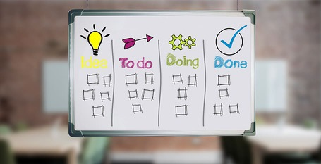

Title: Cómo usar Trello o introducción a Kanban
Language: es
Date: 2020-05-22
Slug: kanban-trello
Tags: Kanban, Trello, Herramientas
Category: Trabajo, Herramientas
Summary: Te propongo usar Trello para manejar nu proyecto sencillo utilizando la metodología Kanban

# Gestión de proyectos medianamente complejos

Supongamos que estoy preparando un viaje de 2 semanas a New York. O supongamos que estoy ayudando a un amigo que se va a casar y quiere organizar la celebración.
O supongamos que estoy desarrollando una aplicación móvil en mi tiempo libre. En todos estos casos tengo una serie de tareas que debo hacer en determinada secuencia y con distintas prioridades.
Mantener la pista de qué debo hacer en cada momento puede llegar a ser complicado. Sin embargo hay una metodología y una herramienta que utilizaría para manejar estos proyectos.
La metodología se llama Kanban y la herramienta se llama [Trello](https://trello.com/).

# Trello para proyectos sencillos

En su forma más simple podemos usar Trello y tener 3 columnas, para "Por hacer", "En proceso" y "Hecho". La columna de "Por hacer" la iremos llenando con todas las actividades necesarias para culminar el proyecto.
Cada vez que vamos a hacer avanzar el proyecto revisaremos la columna de "En proceso" y si hay algo ahí asignado a mí mismo me aseguraré de adelantar en eso hasta que lo termine o hasta que me encuentre bloqueado y no pueda avanzar.
Si no hay nada en la columna de "En proceso" asignado a mí mismo tomaré el tope de la columna "Por hacer" y lo adelantaré hasta que lo termine o hasta que me encuentre bloqueado.

El proceso que describí en el párrafo anterior es la esencia del proceso de Kanban. En el blog de Trello hay un [artículo](https://blog.trello.com/es/metodologia-kanban) dedicado a cómo usar Trello para implementar Kanban
en proyectos muy distintos. Frecuentemente tienen más columnas que las descritas previamente pero esas columnas deben bastar para proyectos sencillos.

# Metodología Kanban

En 1988 Taiichi Ohno y Shigeo Shingö describieron Kanban en libros que explicaban cómo funcionaba el proceso de manufactura de automóviles de Toyota.
El método de fabricación de Toyota utilizaba tarjetas "Kanban" de papel en el que se solicitaban piezas para cada paso de la fabricación de automóviles para lograr
un sistema de control de la producción justo a tiempo flexible y eficiente.

A partir del año 2004 David J. Anderson empezó a aplicar esos conceptos en el desarrollo de software y en el año 2010 publicó el libro "Kanban: Successfully Evolutionary Change for your Technology Business".

La metodología [Kanban](https://es.wikipedia.org/wiki/Kanban) se basa en la visualización del flujo de trabajo para permitir su optimización.
En cada momento se debe limitar la cantidad de trabajo que está en proceso y siempre tratar de terminar lo que se empezó.
Si no queda trabajo en proceso o todo lo que está en proceso está bloqueado se debe tomar el tope de prioridad de la lista de cosas pendientes por hacer y terminarlo.

Si bien para proyectos sencillos se puede utilizar Kanban de forma muy sencilla, para organizaciones que quieren utilizar Kanban de forma efectiva hay algunas prácticas recomendadas.
Esas prácticas pueden no usarse o usarse solamente de forma parcial. La metodología Kanban se basa en aprovechar la experticia del equipo para lograr resultados por lo que
si el equipo decide no usar todas estas prácticas eso sería un buen resultado.

# Roles en Kanban

Así como en Scrum tenemos roles muy específicos para el Scrum Master y el Product Owner, en Kanban no tiene que haber roles definidos. Muchos equipos Kanban siguen la práctica de no usar roles de forma muy exitosa.
Sin embargo muchos equipos Kanban prefieren usar dos roles para lograr mejorar el proceso.

Esos roles son:

- Service Delivery Manager - Esta persona, además de sus labores de desarrollo, debe preocuparse porque el proceso de desarrollo mejore de forma continua.

- Service Request Manager - Esta persona, además de sus labores de desarrollo, debe preocuparse porque el producto desarrollado satisfaga al cliente.

Estos [dos](https://kanbanize.com/blog/kanban-roles/) [artículos](https://kanbanzone.com/2019/kanban-roles-successful-project-management/) describen los roles que se pueden usar en Kanban.

# Reuniones en Kanban

Este [artículo](https://getnave.com/blog/kanban-meetings/) describe con bastante detalle las reuniones que podemos usar en Kanban.

- Daily meeting - Breve reunión diaria para entender cómo va el avance del equipo, qué obstáculos vemos y cómo mejorar el desempeño del equipo. 15 minutos

- Replenishment Meeting - Reunión semanal o cada dos semanas para agregar trabajo en el backlog y priorizarlo. 30 minutos por cada semana

- Service Delivery Review - Reunión cada dos semanas con el cliente para entender sus problemas y poder atenderlos a través del producto desarrollado. 30 minutos

- Delivery Planning Meeting - Reunión para planificar en qué orden se van a desarrollar los cambios y cuándo se pueden entregar esos cambios al cliente. Especialmente útil si los cambios no se le entregan al cliente al momento de culminar su desarrollo. 1 hora

- Operations Review - Reunión mensual entre distintas áreas de la organización para mejorar el proceso de forma integral. 2 horas

- Risk Review - Revisión mensual que revise de los riesgos del proyecto. 1 hora

- Strategy Review - Reunión de muy alto nivel que se realice cada 3 meses y que revise la estrategia de la organización. 4 horas.

# ¿Cómo manejar trabajo bloqueado?

Como Kanban no maneja el concepto de Sprint, en principio no habría nada que impidiera que un elemento de trabajo se bloquee por cualquier razón y permanezca bloqueado por tiempo indefinido.
Por eso es muy importante que cuando usamos Kanban documentemos cada elemento bloqueado detalladamente con la fecha del bloqueo, la razón del bloqueo, la persona que nos está bloqueando.
Cuando el bloqueo se libere documentaremos la fecha de desbloqueo.

# ¿Cuándo aplico Kanban en desarrollo de software?

Usualmente utilizo Scrum como metodología de trabajo para proyectos de desarrollo de software pero algunas veces utilizo Kanban.

Si el proyecto que debo iniciar no se orienta a ciclos de tiempo fijo es probable que deba usar Kanban. Si el proyecto se va a manejar no tiene la dedicación exclusiva del equipo es probable que deba usar Kanban.
Si el proyecto que debo iniciar debe entregar resultados más frecuentemente que una vez a la semana probablemente prefiera usar Kanban.
Si el cliente prefiere trabajar sin comprometer al equipo por una semana voy a proponer usar Kanban.

Este [artículo](https://www.atlassian.com/es/agile/kanban/kanban-vs-scrum) describe las diferencias entre Scrum y Kanban.

# Conclusión

Con este artículo quería lograr dos objetivos: dar a conocer la metodología Kanban como propuesta para organizar el trabajo y dar a conocer Trello como herramienta sencilla para la organización del trabajo.
Espero que hayas conocido un poco mejor la metodología Kanban y cómo aplicarla.
